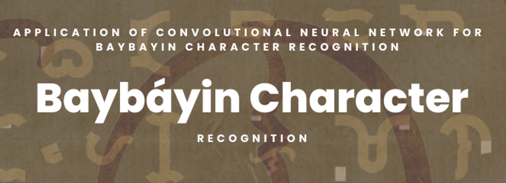
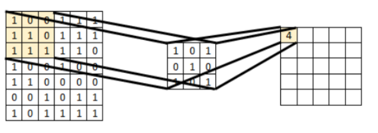
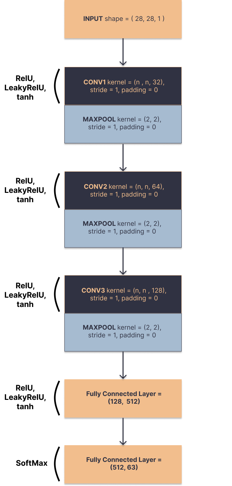

<h1 style='text-align: center;'>Baybayin Character Recognition Using Convolutional Neural Network</h1>

 

In this repository, the researchers designed the Convolutional Neural Network (CNN) for recognizing handwritten baybayin characters. The study involved hyperparameter tuning using Optuna and after identifying the optimal hyperparameters, the model was then trained using the optimal hyperparaeters and tested using the hold-out set. Moreover, The models were trained and evaluated using Python 3.10.6 and NVIDIA T4 x2 from Kaggle.

<h2>Background</h2>

Baybayin is a pre-colonial script indigenous to
the Philippines, used primarily for writing
Tagalog and other native languages. It's an
abugida system with 17 basic characters,
representing consonants with inherent vowel
sounds. Following Spanish colonization,
Baybayin saw a decline, but in recent years, it
has experienced a revival in efforts to preserve
and promote it as a symbol of Filipino cultural
heritage, representing the nation's pre-colonial
identity.

This script has three alphabet characters that
represent the vowels A, E/I, and O/U. Baybáyin
has also 15 consonants namely B, C/K, D, G, H,
L, M, N, NG, P, R, S, T, W, and Y. In the
pre-kudlit system, there’s only as few as 17
Baybáyin characters but in order to better
represent the words, the kudlit system was
introduced which brought the total number of
characters to 63.

Convolutional Neural Networks (CNN) are
always used for character recognition because it
looks for features rather than individual pixels.
Even though CNN’s main applications are for
image recognition or classification, it has
achieved a high accuracy rate in the
classification of the MNIST dataset. The
advantage of CNN's over multilayer perceptrons
is that the number of neurons is way less thus
reducing the computational requirements during
training.

<h2>Methodology</h2>

The type of deep neural network that is
employed in this study is a convolutional neural
network because it has achieved great success in
various computer vision and pattern recognition
applications, including those for handwritten
Chinese character recognition (HCCR) [2]. In
order to obtain the best parameters of the
convolutional neural network (CNN) for this
type of character recognition, various filter
(kernel) sizes were tested. <i>(See Figure Below)</i>

The CNN model's
output size matches the number of Baybáyin
characters, which is 63. Additionally, in all tests,
a range epoch from 10 to 50 were tested, and
the learning rate was also tested from 1e-5, to
1e-1. Prior to using the images to train the neural
network, the only preprocessing steps involved
are converting them into grayscale images,
containing only black and white pixels and
transforming it into tensors.
The model is implemented in python using the
Pytorch library for convolution, pooling, and
fully connected layers. Various optimizers have
been used in the model in order to fit the
optimizer that suits the model well; Adam, SGD
and RMSprop have been used because these
methods are straightforward to implement.

<h2>CNN Architecture</h2>

<h2>References</h2>

[1] J.A Nogra et, al., Baybayin Chacracter Recognition Using Convolutional Neural Network, 2020, pp. 265

[2] L. Bataoil, National Writing System Act. House Bill No. 1022, Phillipine Seventh Congress, First Regular Session, 2018, pp. 3-5
